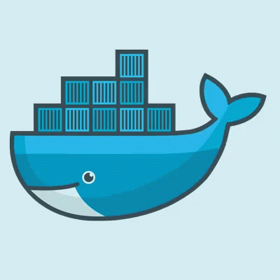

# How to deploy Docker with Apache to Heroku ?

I realize this tutorial to allow my teammates to be able to deploy their "Cogip" project which is requested of us during our training at BeCode Liège.

Apache, by default, listens on port 80 (HTTP), this isn’t a problem when running the server on your machine. But some cloud providers require that containers use different ports.

In this repository I will detail how to configure an apache environment to deploy it on Heroku.


## Set up

Normally, **you must** set up an environment variables for development **before deploying your project on GitHub**.
You can see how to do it [below](https://github.com/Maxime-Bott/how_to_deploy_docker_apache_to_heroku/blob/main/README.md#set-environment-variables-during-the-development).

For this tutorial you will need :
- Docker
- Free Heroku account
- Heroku CLI set up on your machine for easier use
- Composer (Included in the ``Dockerfile``)
- Your project deployed to GitHub

You need to use the same `Dockerfile`, `docker-compose.yml` and `heroku.yml` from this repository (do not forget the `conf` folder).
Respect the folder architecture as in this repository.

> **NOTE:** There are two possibilities for your database. You can use it locally but Heroku will need an add-on like [ClearDB MySQL](https://devcenter.heroku.com/articles/cleardb) (There is a free option but Heroku requires you to enter a credit card). For this guide I would use [RemoteMySQL](https://remotemysql.com/) which is a free remote database.

> **IMPORTANT:** Ensure the ``start-apache`` file in the `conf` folder is executable with de command line below 
```
chmod 755 start-apache
```


## Install Heroku CLI

The first step is to install the Heroku command lines.

- For Ubuntu
    ```
    sudo snap install --classic heroku
    ```
- For MacOS
    ```
    brew tap heroku/brew && brew install heroku
    ```

You can refer to this guide [Install Heroku CLI](https://devcenter.heroku.com/articles/heroku-cli).


## Deploy Docker to Heroku

### Link your GitHub project to Heroku

- Go to this [link](https://dashboard.heroku.com/new-app) and create your project

- Go to deploy and select "Connect to GitHub"

- Go to automatic deploy, select your branch and enable automatic deployment

### Now that your project is linked to Heroku, we need to tell it that we are using Docker


In your terminal at the root of your project type :
- Log in to Container Registry:
    ```
    heroku container:login
    ```

- Apache configuration
    ```
    heroku labs:enable --app=YOUR_HEROKU_APP_NAME runtime-new-layer-extract
    ```

- Make sure your stack is in a container
    ```
    heroku stack:set container --app YOUR_HEROKU_APP_NAME
    ```
- Build the image and push to Container Registry:
    ```
    heroku container:push web --app YOUR_HEROKU_APP_NAME
    ```

- Then release the image to your app:
    ```
    heroku container:release web --app YOUR_HEROKU_APP_NAME
    ```

## Your application is now deployed, configure your environment variables

### Set environment variables for Heroku

In your terminal at the root of your project type :
- Set a config var 
    ```
    heroku config:set DB_NAME=VALUE --app YOUR_HEROKU_APP_NAME
    ```

- View current config var values
    ```
    heroku config --app YOUR_HEROKU_APP_NAME
    ```

You can now use your variables, for example : 

```
$dbUsername = getenv('DB_NAME');
$dbPassword = getenv('DB_PASSWORD');

$db = new PDO("mysql:host=remotemysql;dbname=$dbUsername;port=3306","$dbUsername","$dbPassword");
```
>**IMPORTANT:** Your variables will only be accessible on Heroku, during your development phase you must use another environment of variables

You can refer to this guide [Config vars](https://devcenter.heroku.com/articles/config-vars).

### Set environment variables during the development


For my development environment, I used a Composer library (vlucas/phpdotenv).

You can find the library documentation [here](https://github.com/vlucas/phpdotenv).

### Access to Composer via Docker

In your terminal at the root of your project type :

- Show all active containers
    ```
    docker ps -a
    ```
    Copy the php container ID number.

- Run a command in a running container (to access Composer)
    ```
    docker exec -ti YOUR_ID_NUMBER sh
    ```

- Install phpdotenv library
    ```
    composer require vlucas/phpdotenv
    ```
    (Type "exit" for leave the container)

### Configure Composer

Now that your library is installed, we can configure it.

Create a file named `.env` **at the root** of your `index.php`. This is where we will declare our environment variables for development.

Create a `.gitignore` at the root of your project and add this :
```
vendor
src/.env
```

In your `index.php`, add this : 
```


if (file_exists(__DIR__ . '/.env')) {
    require('vendor/autoload.php');
    $dotenv = Dotenv\Dotenv::createImmutable(__DIR__);
    $dotenv->load();
}
```

In your `.env` , declare your variables : 

```
DB_NAME = "MY_VALUE"
DB_PASSWORD = "MY_VALUE"
```

In your file where your PDO object is (`manager.php`), add this : 

```
if (file_exists(__DIR__ . '/../.env')) {
            $dbUsername = $_ENV['DB_NAME'];
            $dbPassword= $_ENV['DB_PASSWORD'];
        } else {
            $dbUsername = getenv('DB_NAME');
            $dbPassword = getenv('DB_PASSWORD');
        }
```
> This allows you to define which variables to use,
If the file exists it means that you are in development otherwise the values will be that of Heroku

I still specify that it will not work if you use a local database, you must install an Heroku add-on as specified [here](https://github.com/Maxime-Bott/how_to_deploy_docker_apache_to_heroku#set-up)

I didn't specify how to configure the Heroku ports, Everything is in the `Dockerfile` and in the `conf` folder. You can follow the documentations below for more information


### I hope this tutorial is clear, if you have any questions do not hesitate to contact me

Ref :
- https://devcenter.heroku.com/categories/deploying-with-docker
- https://medium.com/@sonusamjoseph/deploying-your-legacy-php-application-on-heroku-with-docker-2cbab94b5c46
- https://semaphoreci.com/community/tutorials/dockerizing-a-php-application


